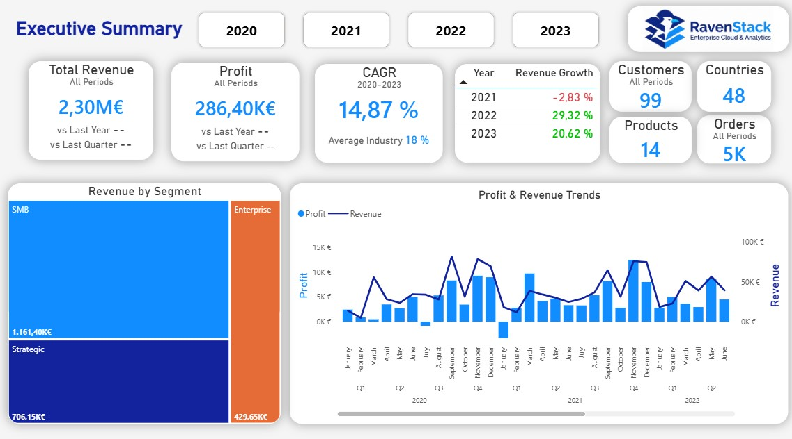
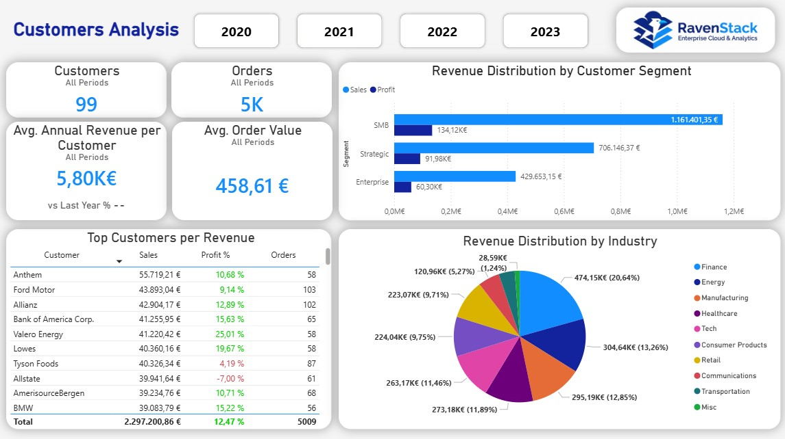
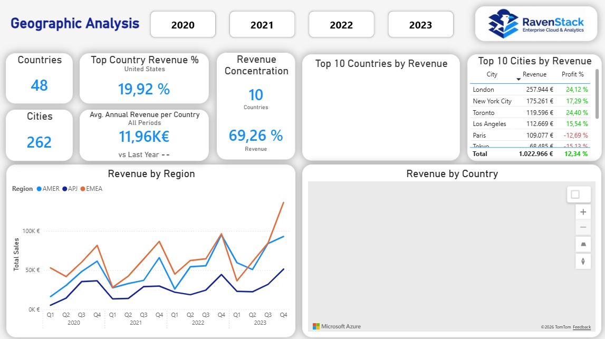
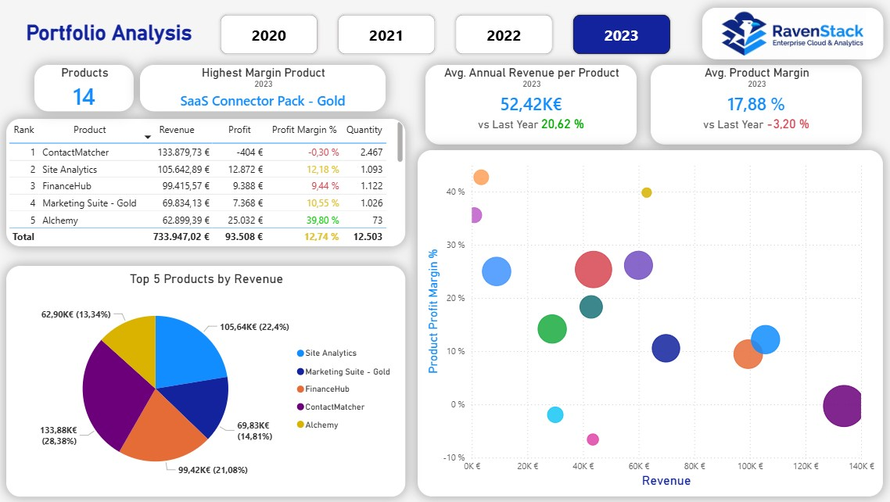
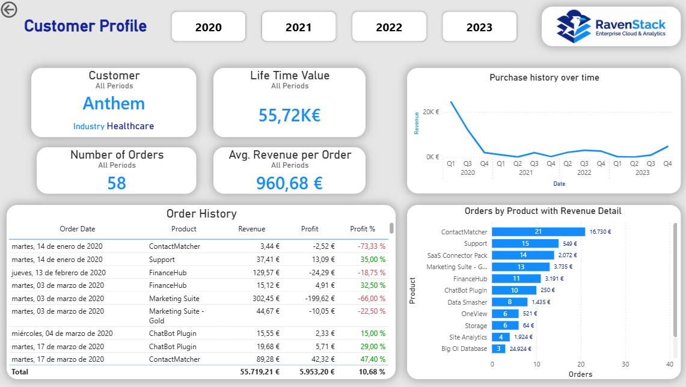
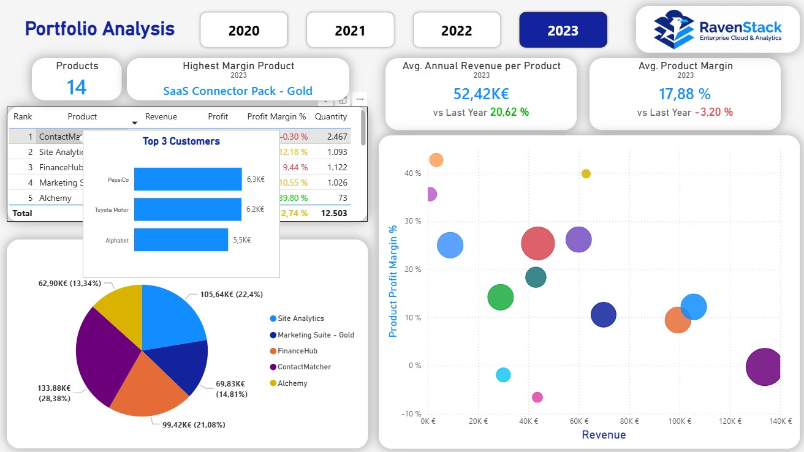

# RavenStack SaaS Financial Analytics Dashboard

Power BI dashboard analyzing €2.3M in B2B SaaS revenue across 99 customers, 48 countries, and 14 products (2020–2023). Built as a CFO-ready tool to surface business risks, growth levers, and actionable recommendations.



---

## Project Overview

The goal was to take a raw transactional dataset and turn it into something a finance team could actually use — not just charts, but a tool that answers questions like *where are we losing money*, *which customers are at risk*, and *what should we prioritize next quarter*.

The most significant finding: **zero consistency in top revenue customers year-over-year**. The top 5 accounts reshuffled completely every year, representing over €200K in unstable revenue. That insight alone shaped the strategic recommendations.

**Projected impact of proposed actions:** €400K+ in profit improvement over 3 years.

---

## Dashboard Pages

### Executive Summary
Financial KPIs, growth trends, revenue by segment. CAGR of 14.87% (2020–2023), profit margin at 12.47%. Includes dynamic YoY/QoQ comparisons with conditional logic that suppresses misleading comparisons when filters don't support them.

### Customer Analysis
Segmentation, retention patterns, top accounts. 99 customers with €5.8K average annual revenue per customer. Interactive drill-through to individual customer profiles with full purchase history and product mix.

### Geography Analysis
Regional performance and market concentration across 48 countries and 262 cities. Pareto analysis shows 10 countries driving 69% of revenue. Custom tooltips let you hover over any country to see its top 3 products.

### Portfolio Analysis
Product profitability and strategic positioning for all 14 products. Highlights include Alchemy (40% margin, 473% growth — clear star product) and ContactMatcher (top revenue generator but -0.3% margin in 2023, functioning as a loss leader). Custom tooltips show top 3 customers per product on hover.

---

## Technical Implementation

### Data Architecture
- **Source:** AWS SaaS Sales dataset (Kaggle) — 9,800 transactions
- **Validation:** SQL quality checks run before importing into Power BI
- **Model:** Star schema with 1 fact table and 4 dimension tables
- **Grain:** Transaction-level

```
FactTable (9,800 rows)
    ├── DimDate (1,461 rows)
    ├── DimCustomer (99 rows)
    ├── DimGeography (262 rows)
    └── DimProduct (14 rows)
```

### DAX (50+ measures)

The measure library covers base metrics, time intelligence (YoY, QoQ, YTD, CAGR), annualized averages for cross-period comparison, Pareto calculations, and product rankings.

A recurring design decision was making comparisons context-aware. For example, showing a QoQ change when the user has multiple years selected would be misleading, so the measure returns `"--"` instead:

```dax
Sales vs Last Quarter % = 
VAR YearsSelected = DISTINCTCOUNT(DimDate[Year])
VAR QuarterLevel = HASONEVALUE(DimDate[Quarter])
RETURN
    IF(YearsSelected <> 1 || NOT QuarterLevel, "--", [Calculation])
```

Standard time intelligence using `SAMEPERIODLASTYEAR`:

```dax
Sales vs Last Year % = 
VAR PriorYearSales = 
    CALCULATE([Total Sales], SAMEPERIODLASTYEAR(DimDate[Date]))
RETURN
    DIVIDE([Total Sales] - PriorYearSales, PriorYearSales)
```

### Interactive Features
- **Customer drill-through:** Right-click any customer name to open a full profile page with purchase history, product breakdown, and order timeline
- **Geographic tooltips:** Hover over a country to see its top 3 products
- **Product tooltips:** Hover over a product to see its top 3 customers
- **Dynamic period display:** Labels and titles adapt to whatever filter combination is active

---

## Key Findings and Recommendations

### 1. Customer Retention Problem

This was the biggest red flag. The top 5 revenue customers changed completely every year. Anthem, for instance, went from €38K in 2020 to near-zero in subsequent years. Without a retention mechanism, the company is essentially re-acquiring its revenue base annually.

**Recommendation:** Implement customer health scoring, assign dedicated account managers to high-value accounts, and build out a customer success function. This alone accounts for most of the projected €400K profit improvement.

### 2. Product Portfolio Imbalance

Alchemy is the clear winner — high margin, strong growth, top profit contributor. ContactMatcher is the opposite: highest revenue but negative margin. The question isn't whether to kill ContactMatcher (it drives customer acquisition), but whether to deliberately position it as a bundled entry point alongside higher-margin products like Alchemy.

**Recommendation:** Scale Alchemy aggressively (2x revenue target), formalize ContactMatcher as a strategic loss leader, and implement bundling.

### 3. Geographic Concentration Risk

Southeast Asian markets are delivering margins above 25% vs. the 12.47% company average, but remain underinvested. Meanwhile, Japan sits at -15% margin and needs a fix-or-exit decision. The UK market is 90% concentrated in London — a diversification risk.

**Recommendation:** Prioritize SEA expansion, address Japan profitability, diversify UK presence beyond London.

---

## Documentation

### [Technical Documentation](docs/Technical_Documentation.md)
Full reference covering data validation (SQL), star schema design, all 50+ DAX formulas with rationale, page specifications, and the ~25-hour development timeline. 1,167 lines.

### [Business Insights & Strategic Recommendations](docs/Business_Insights.md)
CFO-oriented analysis: current state assessment, risk prioritization, three strategic recommendations with action plans, implementation timeline (Q1–Q4 2026), and projected financial impact (€1.1–1.2M revenue, 16–17% margins). 486 lines.

---

## Dashboard Screenshots

<details>
<summary><b>View all pages</b></summary>

### Executive Summary


### Customer Analysis


### Geography Analysis


### Portfolio Analysis


### Customer Drill-Through


### Tooltips


</details>

---

## Skills Applied

**Technical:** Power BI (advanced visuals, UX design), DAX (time intelligence, context-aware logic), SQL (data validation), star schema modeling, Power Query (ETL)

**Business:** Revenue and profitability analysis, customer retention analysis, product portfolio strategy (BCG-style), geographic market assessment, executive-level reporting

---

## Project Details

| | |
|---|---|
| Development time | ~25 hours |
| Dashboard pages | 7 (4 main + 3 hidden/support) |
| DAX measures | 50+ |
| Transactions | 9,800 |
| Customers | 99 |
| Countries | 48 |
| Documentation | 1,653 lines |
| Dataset | [AWS SaaS Sales](https://www.kaggle.com/) (public) |
| Completed | January 2026 |

---

Built as part of my transition into Business Intelligence and Financial Analysis. The focus was on demonstrating end-to-end capability: from data validation and modeling through to strategic business recommendations that a leadership team could act on.
